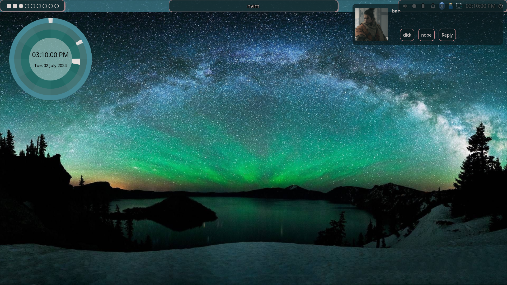
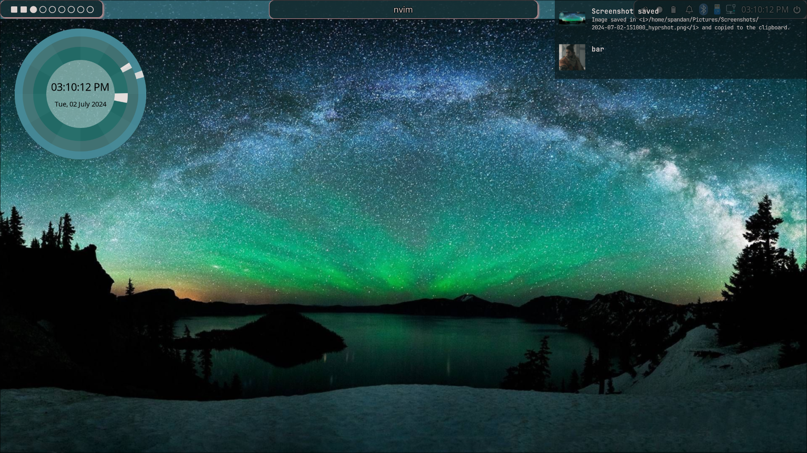
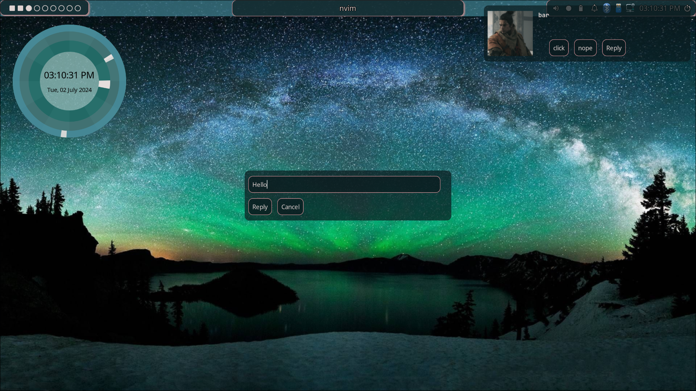

# Eww Notification Daemon (in Rust)

A notification daemon for linux written in Rust. Inspired by [end](https://github.com/lucalabs-de/end).

There are a few great notification daemons around. Unfortunately, they all use their own configuration language. 
If you already use [eww](https://github.com/elkowar/eww) for your widgets, wouldn't it be great if you could just use it for your notifications as well?



## Features

- Display notifications using eww
- Customizable notification appearance
- Customizable notification duration
- Notification history
- Notification actions
- In-reply for notifications (not in the freedesktop notification spec)
- Multi-monitor support

## Getting Started

You can either build the project yourself or use one of the prebuilt binaries from [crates.io](https://crates.io).

### Building from Source

Clone the repository and run the following commands to build.

```sh
git clone https://github.com/Dr-42/end-rs
cd end-rs
cargo build --release
```

This will create the executable under `target/release`.
Copy it to your desired location.

### Install from Crates.io

```sh
cargo install end-rs
```

This will install the executable under `~/.cargo/bin`. Make sure you have that added in your path.
For more details on how to install Rust and Cargo, check out [rustup](https://rustup.rs/).

## Usage

### Daemon

To start the notification daemon, have it autostart in your WM's init file with the daemon argument.

Example for hyprland
```hyrlang
exec-once = ~/.cargo/bin/end-rs daemon
```

Other details about the configuration can be found passing -h or --help to the executable.

### Eww Configuration
You can generate the default yuck and scss files by running the generate command.

yuck
```sh
end-rs generate yuck
```
scss
```sh
end-rs generate scss
```
both
```sh
end-rs generate all
```

This will create the files `end.yuck` and `end.scss` in the eww config directory.

To use them, just include them in your eww config file.

```yuck
(include "end.yuck")
```

```scss
@import "end.scss";
```

### Commands

Typing `end-rs` will show the help message with all the available commands.

```sh
$ end-rs --help
end-rs <version>
Usage: end-rs [OPTIONS] <COMMAND> <args>

Options:
  -h, --help - Print this help message
  -v, --version - Print version information
Commands:
  daemon - Start the notification daemon
  close <id> - Close a notification with the given ID
  history <open|close|toggle> - Open, close or toggle the notification history
  action <id> <action> - Perform an action on a notification with the given ID

  generate [css|yuck|all] - Generate the eww config files
```
All commands require the daemon to be running except for the generate command.

## Configuration

End checks `$XDG_CONFIG_HOME/end-rs` (most likely `~/.config/end-rs`) for a `config.toml`. If the file is not found, it will create one with the default values.

**All fields are madatory unlike the original end**

The configuration file is structured as follows.

```toml
### Path to the eww binary
eww_binary_path = "~/.local/bin/eww"
### Where to find the icons for the notifications
icon_dirs = [
    "/usr/share/icons",
    "/usr/share/pixmaps",
]
### The theme to use for the icons
icon_theme = "Adwaita"
### The default notification window
### Can be a single string or a vector of strings(for multi-monitor support)
eww_notification_window = "notification-frame"
### The default notification widget
eww_notification_widget = "end-notification"
### The variable which contains the literal for the notifications
eww_notification_var = "end-notifications"

### The default history window
eww_history_window = "history-frame"
### The default history widget
eww_history_widget = "end-history"
### The variable which contains the literal for the history
eww_history_var = "end-histories"

### The default reply window
eww_reply_window = "reply-frame"
### The default reply widget
eww_reply_widget = "end-reply"
### The variable which contains the literal for the replies
eww_reply_var = "end-replies"
### The variable which contains content for the reply text
eww_reply_text = "end-reply-text"
### Max notifications to be preserved in history. In case of 0, all notifications will be preserved.
max_notifications = 10
### The orientation of the notifications. Can be either "v" or "h" or "vertical" or "horizontal" (Basically the eww orientation value)
notification_orientation = "v"

### The timeouts for different types of notifications in seconds. A value of 0 means that the notification will never timeout
[timeout]
low = 5
normal = 10
critical = 0
```

## Images

The free desktop spec defines 3 ways to include images in the notifications.
1. image-path: The path to the image file
2. image-data: The image data in base64 format
3. image_path: The path to the image file (This is deprecated but some reason some applications still use it)

End-rs supports all 3 ways. In case it detects a path, it will show the image from the path. In case it detects a valid icon as per the icon theme, it will show the icon. In case it detects a base64 encoded image, it will write the image to a temporary file save it in ```/tmp/end-data/...``` and show the image from there as eww does not support base64 encoded images.

In yuck, it will set the image field of the notification to the path of the image file.

## Screenshots

### Simple Notification


### History


### Reply



## License
This project is licensed under the BSD 2-Clause License - see the [LICENSE](LICENSE) file for details.

## FAQs

### Why Rust?
Rust is a great language for system programming. It is fast, safe and has a great community. It is also a great language for writing CLI tools. And anyways, who doesn't like Rust?

### Why not just use end?
End is a great notification daemon. I basically had a two reasons to write this.
1. Custom eww binary path - Apparently for some reason hyprland was not loading the path from my zshrs so I had to go into the source code, compile my own version and then use it. I wanted to be able to set the path to the eww binary in the config file.
2. image_path - kdeconnect uses image_path instead of image-path. End does not support this. This is where I got stuck as I don't know haskell. So I thought why not Rewrite it in Rust<sup>TM</sup>.
3. In-reply - I wanted to be able to reply to notifications. I know this is not in the freedesktop notification spec but I wanted to have it. I tested it only on kdeconnect notifications and it works. If you use it on other notifications, please let me know if it has any issues.

### Why not just fork end?
As I said, I don't know haskell. I know Rust. So I rewrote it in Rust.

### Why not just use dunst?
I use eww for my widgets. I wanted to use it for my notifications as well. Also, I wanted all of my desktop to have matching colors to the wallpaper and I use a python script to generate colors from the color wallpaper and feed it into eww. Hence, this setup.

### I am facing an issue
Please open an issue on the github repository. I will try to help you out.

### I want to contribute
Please open a PR on the github repository. I will review it and merge it if it is good. Please make sure to run `cargo fmt` before opening the PR.

### I have a feature request
Please open an issue on the github repository. I will try to implement it if it is feasible.


## Acknowledgements
1. [end](https://github.com/lucalabs-de/end) - If I didn't know about this, I wouldn't have written this. That surely took away 3 weeks of my life learning DBUS spec and its zbus implementation in rust. But I didn't steal any of his code. Heck I didn't even understand his code. I just read the spec and implemented it in Rust.
2. [eww](https://github.com/elkowar/eww) - For the great widgets pumping my Hyprland installation.

